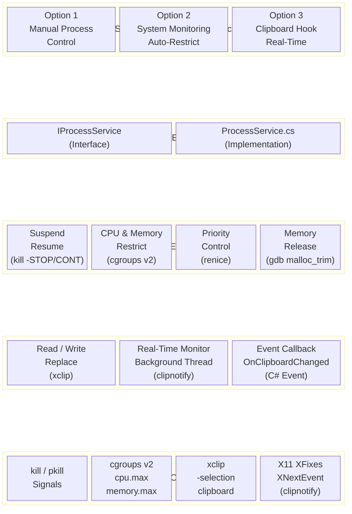
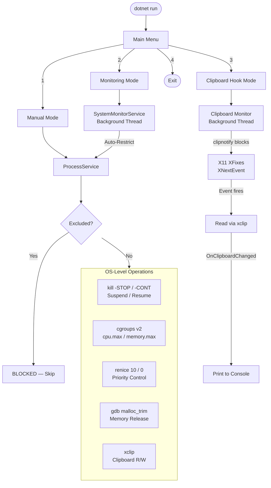

# App.Net — Linux Process Manager

A CLI-based Linux process management application built with **.NET 8 / C#**, designed to monitor, control, and restrict system processes in real-time on an Ubuntu VM. It also features a **real-time clipboard hook** powered by the X11 XFixes extension for event-driven clipboard monitoring.

---

## Table of Contents

- [Features](#features)
- [Architecture](#architecture)
- [Project Structure](#project-structure)
- [Prerequisites](#prerequisites)
- [Installation & Setup](#installation--setup)
- [How to Run](#how-to-run)
- [Usage Guide](#usage-guide)
  - [Option 1 — Manual Process Control](#option-1--manual-process-control)
  - [Option 2 — System Monitoring (Auto-Restrict)](#option-2--system-monitoring-auto-restrict)
  - [Option 3 — Real-Time Clipboard Hook](#option-3--real-time-clipboard-hook)
- [Workflow Diagram](#workflow-diagram)
- [Technologies Used](#technologies-used)
- [CLI Command Reference](#cli-command-reference)

---

## Features

### Process Management
- **Suspend / Resume** — Send `SIGSTOP` / `SIGCONT` signals to any process by PID or by username.
- **Block / Unblock** — Freeze a process system-wide or per-user using `pkill`.
- **Priority Control** — Lower (`renice 10`) or restore (`renice 0`) process scheduling priority.
- **Memory Release** — Safely free unused heap memory inside a running process using `gdb` + `malloc_trim(0)` without crashing it.

### Resource Restriction (cgroups v2)
- **CPU Limiting** — Dynamically cap a process's CPU usage using `cpu.max` in cgroups v2.
- **Memory Limiting** — Dynamically cap a process's memory using `memory.max` in cgroups v2.
- **Per-User Restriction** — Restrict all instances of a process for a specific user.
- **Remove Restriction** — Move the process back to the root cgroup and delete the custom cgroup folder.

### System Monitoring (Auto-Restrict)
- **Background Monitor Thread** — Runs in the background, polling CPU and memory usage every 5 seconds.
- **Auto-Restrict** — When system CPU > 80% or Memory > 80%, automatically restricts the top resource-consuming processes.
- **Independent Tracking** — CPU-restricted and memory-restricted processes are tracked separately.

### Clipboard Hook (Real-Time, Event-Driven)
- **Read / Write / Clear** — Full clipboard operations using `xclip -selection clipboard`.
- **Find & Replace** — Reads clipboard, replaces matching text, writes back the full modified clipboard.
- **Real-Time Monitor** — Uses `clipnotify` (X11 XFixes extension) for zero-CPU, event-driven clipboard change detection.
- **C# Event Callback** — Fires `OnClipboardChanged` event instantly when new content is copied anywhere in the GUI.
- **No Polling, No Delays** — The background thread blocks on `XNextEvent`, consuming 0% CPU until a clipboard change occurs.

### Exclude List (Safety System)
- **Default Protected** — System-critical processes (`systemd`, `bash`, `sshd`, `dotnet`, etc.) can never be suspended or restricted.
- **User Customizable** — Add or remove custom process names at runtime.
- **C# Events** — Fires `OnExcludeEvent` with actions: `ADDED`, `REMOVED`, `BLOCKED`.

---

## Architecture



---

## Project Structure

```
App.Net/
│
├── Program.cs                      # Main CLI entry point with 3 modes
├── ProcessService.cs               # Core implementation of all features
├── SystemMonitorService.cs         # Background system monitor with auto-restrict
│
├── IProcessService.cs              # Combined interface (extends all below)
├── ISuspendResumeService.cs        # Interface for suspend/resume operations
├── IResourceRestrictionService.cs  # Interface for CPU/memory restriction
├── IBlockService.cs                # Interface for block/unblock operations
├── IPriorityService.cs             # Interface for priority control
├── IMemoryReleaseService.cs        # Interface for memory release
├── IClipboardService.cs            # Interface for clipboard hook
├── IExcludeListService.cs          # Interface for exclude list + events
│
├── MyApp.csproj                    # .NET 8 project file
├── setup.sh                        # Full VM setup script (run once)
├── run.sh                          # Build and run script
│
├── dummy_load.py                   # Python script to simulate CPU load
├── memory_test.py                  # Python script to simulate memory load
├── test_demo.sh                    # Automated demo/test script
│
├── block_python3.bt                # bpftrace script for blocking python3
├── block_python3_dummyuser.bt      # bpftrace script for blocking per-user
│
└── README.md                       # This file
```

---

## Prerequisites

| Requirement      | Version     | Purpose                                  |
|------------------|-------------|------------------------------------------|
| Ubuntu Linux     | 22.04+      | Target operating system                  |
| .NET SDK         | 8.0         | Build and run the C# application         |
| xclip            | any         | Read/write GUI clipboard                 |
| clipnotify       | latest      | Real-time clipboard event detection      |
| cgroups v2       | kernel 5.8+ | CPU and memory restriction               |
| gdb              | any         | Safe memory release via `malloc_trim`    |
| X11 (GUI)        | any         | Required for clipboard operations        |

---

## Installation & Setup

### Step 1 — Set Up the Linux VM

Run the provided setup script **once** on your Ubuntu VM as root. It installs everything you need:

```bash
sudo bash setup.sh
```

**What `setup.sh` does:**
1. Updates system packages
2. Installs .NET 8 SDK from Microsoft repository
3. Installs utility tools (`procps`, `xclip`, `python3`, `bpftrace`)
4. Builds and installs `clipnotify` from source (X11 XFixes clipboard monitor)
5. Enables cgroups v2 with CPU + memory controllers
6. Creates a test user `dummyuser` for testing per-user operations
7. Configures passwordless `sudo` for required system commands

### Step 2 — Copy Project Files to VM

Copy all project files from your local machine to the VM:

```bash
# From your local Windows machine (using SCP)
scp -r D:\Work\* user@vm-ip:/home/user/App.Net/
```

### Step 3 — Build the Project

```bash
cd /home/user/App.Net
dotnet build
```

---

## How to Run

### Using the run script:
```bash
bash run.sh
```

### Manually:
```bash
sudo dotnet run
```

> **Note:** `sudo` is required because the application manages system processes, cgroups, and process signals.

---

## Usage Guide

When the application starts, you will see the main menu:

```
==========================================
       === Linux Process Manager ===
==========================================

Choose an option:
  1. Suspend and Resume Process Manually
  2. System Monitoring (Auto-restrict)
  3. Clipboard Hook (Real-Time)
  4. Exit

Enter choice (1/2/3/4):
```

---

### Option 1 — Manual Process Control

Interactive CLI for manually controlling processes.

```
admin@manual> help

Manual Mode Commands:

  suspend <pid>            - Suspend a process by PID
  suspend-user <username>  - Suspend all processes of a user
  resume <pid>             - Resume a process by PID
  resume-user <username>   - Resume all processes of a user
  exclude-add <name>       - Add process to exclude list
  exclude-remove <name>    - Remove process from exclude list
  exclude-list             - Show all excluded processes
  clip-get                 - Output current clipboard contents
  clip-set <text>          - Overwrite the clipboard
  clip-clear               - Empty the clipboard
  clip-replace <f> <r>     - Find and replace text in clipboard
  back                     - Return to main menu
```

**Example:**
```
admin@manual> suspend 1234
[SUSPENDED] 1234

admin@manual> resume 1234
[RESUMED] 1234
```

---

### Option 2 — System Monitoring (Auto-Restrict)

Starts a background monitor thread that watches system resources and auto-restricts heavy processes.

- Polls CPU and memory every **5 seconds**
- If **CPU > 80%** → restricts top CPU-consuming processes via cgroups `cpu.max`
- If **Memory > 80%** → restricts top memory-consuming processes via cgroups `memory.max`
- You can still type CLI commands while the monitor runs in the background

**Available commands include everything from Manual Mode plus:**

```
  restrict-cpu <pid> <name>             - Restrict CPU for a process
  restrict-mem <pid> <name>             - Restrict memory for a process
  restrict <processname>                - Restrict all instances (CPU + Memory)
  restrict-user <processname> <user>    - Restrict per user
  remove-restrict <pid>                 - Remove restriction from a process
  block-process <name>                  - Freeze a process system-wide
  block-process-user <name> <user>      - Freeze a process for a specific user
  unblock-process <name>                - Unfreeze a process
  reduce-priority <pid>                 - Lower a process priority (nice 10)
  reduce-priority-name <name>           - Lower priority by name
  restore-priority <pid>               - Restore priority (nice 0)
  release-memory <pid>                 - Release unused heap memory
  release-memory-name <name>           - Release memory by name
```

**Example auto-restrict output:**
```
CPU: 92.3% | MEMORY: 45.2%
[ALERT] High CPU usage detected!
[CPU RESTRICT] python3 (PID:5678) CPU:85.2%
[CPU RESTRICTED] PID 5678 — Usage: 85.2% → Limit: 42.6%
```

---

### Option 3 — Real-Time Clipboard Hook

Starts an event-driven background monitor that **instantly detects** when the user copies any text to the clipboard.

**How it works internally:**
1. A background thread launches `clipnotify -s clipboard`
2. `clipnotify` uses the **X11 XFixes extension** (`XFixesSelectSelectionInput` + `XNextEvent`)
3. The thread **blocks** (0% CPU) until the clipboard ownership changes
4. When a copy event fires, the app reads the new clipboard text via `xclip`
5. The C# event `OnClipboardChanged` fires, triggering the real-time callback

**When you copy text anywhere on the desktop, the terminal instantly shows:**
```
╔══════════════════════════════════════════╗
║     [CLIPBOARD COPIED] — Real-Time      ║
╠══════════════════════════════════════════╣
║  Content: Hello World
╚══════════════════════════════════════════╝
```

**Available commands:**
```
  clip-get                 - Show current clipboard content
  clip-set <text>          - Replace full clipboard with text
  clip-clear               - Clear the clipboard
  clip-replace <find> <r>  - Find and replace in clipboard
  back                     - Stop monitor & return to menu
```

**Example — Find & Replace Hook:**
```
admin@clipboard> clip-replace Apple Linux
[CLIPBOARD HOOKED] Replaced "Apple" with "Linux"
```

---

## Workflow Diagram



---

## Technologies Used

| Technology             | Usage                                                  |
|------------------------|--------------------------------------------------------|
| **C# / .NET 8**       | Application logic, CLI interface, threading, events    |
| **Linux Signals**      | `kill -STOP` / `-CONT` for suspend/resume              |
| **cgroups v2**         | `cpu.max` and `memory.max` for resource restriction    |
| **renice**             | Process scheduling priority control                    |
| **gdb**                | Attach to process and call `malloc_trim(0)` safely     |
| **xclip**              | Read/write the X11 GUI clipboard                       |
| **clipnotify**         | Real-time clipboard event detection (X11 XFixes)       |
| **X11 XFixes**         | `XFixesSelectSelectionInput` + `XNextEvent` internally |
| **System.Threading**   | Background threads for monitor and clipboard listener  |
| **C# Events**          | `OnClipboardChanged`, `OnExcludeEvent` callbacks       |

---

## CLI Command Reference

### Global (All Modes)
| Command | Description |
|---|---|
| `help` | Show available commands |
| `back` | Return to main menu |

### Process Control
| Command | Description |
|---|---|
| `suspend <pid>` | Suspend a process |
| `suspend-user <username>` | Suspend all user processes |
| `resume <pid>` | Resume a process |
| `resume-user <username>` | Resume all user processes |
| `block-process <name>` | Block a process system-wide |
| `block-process-user <name> <user>` | Block for a specific user |
| `unblock-process <name>` | Unblock a process |
| `unblock-process-user <name> <user>` | Unblock for a specific user |

### Resource Restriction
| Command | Description |
|---|---|
| `restrict <name>` | Restrict CPU + Memory (all instances) |
| `restrict-cpu <pid> <name>` | Restrict CPU only |
| `restrict-mem <pid> <name>` | Restrict memory only |
| `restrict-user <name> <user>` | Restrict per user |
| `remove-restrict <pid>` | Remove restriction |

### Priority & Memory
| Command | Description |
|---|---|
| `reduce-priority <pid>` | Set nice value to 10 |
| `reduce-priority-name <name>` | Set nice by process name |
| `restore-priority <pid>` | Restore nice to 0 |
| `release-memory <pid>` | Free unused heap memory |
| `release-memory-name <name>` | Free memory by name |

### Clipboard
| Command | Description |
|---|---|
| `clip-get` | Read current clipboard |
| `clip-set <text>` | Write text to clipboard |
| `clip-clear` | Clear clipboard |
| `clip-replace <find> <replace>` | Find and replace in clipboard |

### Exclude List
| Command | Description |
|---|---|
| `exclude-add <name>` | Add to exclude list |
| `exclude-remove <name>` | Remove from exclude list |
| `exclude-list` | Show all excluded processes |

---

## Testing

### Generate CPU Load
```bash
python3 dummy_load.py &
```

### Generate Memory Load
```bash
python3 memory_test.py &
```

### Run Automated Demo
```bash
bash test_demo.sh
```

---

## License

Internal project — App.Net

---
